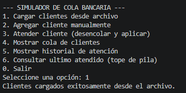
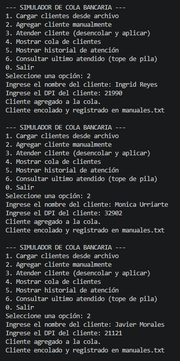
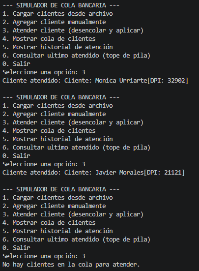
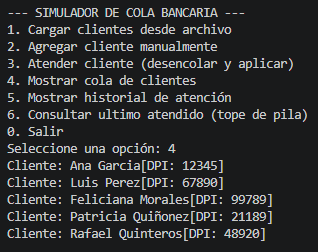
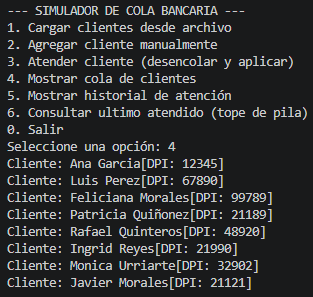
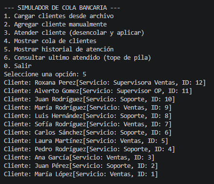
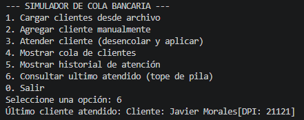
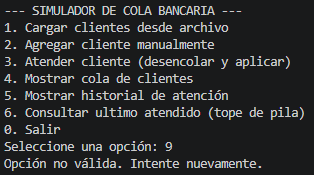

# SIMULADOR BANCARIO
--------------------------------
##### Simulador de Cola de Atención al Cliente para una sucursal bancaria, aplicando los conceptos de Pilas y Colas implementados desde cero con nodos y punteros en Java

<div align="center">


-----------------------------------------------
## Estructura del simulador
```text
SimuladorBancario/
│
├── src/                          # Carpeta de código fuente
│   └── com/
│       └── banco/
│           ├── modelos/          # Clases de datos 
│           │   ├── Cliente.java
│           │   └── Nodo.java
│           │
│           ├── estructuras/      # Implementaciones de cola y pila
│           │   ├── Cola.java
│           │   └── Pila.java
│           │
│           └── principal/        # Main y menu
│               └── SimuladorBancario.java
│
├── data/                         # Carpeta para archivos externos
│   └── clientes.txt              # El archivo de texto con clientes existentes
|   └── manuales.txt              # El archivo de texto con clientes cargados manualmente
|
|
├── docs/                         # Documentación adicional
│   └── images/                   
│       ├── captura_menu.png
│       └── diagrama_casos_uso.png
│
└── README.md                     # Documentación del proyecto
```
------------------------------------------------
##  Modo de Uso

El simulador permite gestionar el flujo completo de un cliente, desde su llegada hasta que finaliza su atención. 

### 1. Preparación de Datos
Antes de iniciar, asegúrate de tener el archivo `data/clientes.txt` con el formato `Nombre, DPI`. 
>   **Ejemplo:** `Juan Perez, 12345`

### 2. Carga de Clientes (Opción 1)
Al seleccionar esta opción, el sistema lee el archivo maestro y los añade a la **Cola de Espera** (Estructura FIFO). Los clientes se posicionan uno detrás de otro según el orden en el archivo.

### 3. Registro Manual (Opción 2)
Si llega un cliente nuevo a la sucursal:
>   -Ingresa su nombre y DPI.
>   -El sistema lo **encola** al final de la fila actual.
>   -Se genera un registro automático en `manuales.txt` para auditoría externa.
>   -Nota: *Si lo desea puede copiar los datos de `manuales.txt` a `clientes.txt`*

### 4. Atención al Cliente (Opción 3)
Esta opción ejecuta la lógica principal de estructuras de datos:
> 1.  **Desencolar:** Se retira al cliente que está al **frente** de la Cola (el primero que llegó).
>
> 2.  **Apilar:** Ese mismo cliente se mueve inmediatamente a la **Pila de Historial**.

> *Internamente, el puntero del frente de la cola se mueve al siguiente nodo, y el tope de la pila se actualiza con el cliente recién atendido.*

### 5. Consultas y Reportes (Opciones 4, 5 y 6)
>   **Ver Cola:** Muestra quiénes están esperando y en qué orden.
>
>   **Ver Historial:** Muestra a todos los clientes ya atendidos (del más reciente al más antiguo).
>
>   **Último Atendido:** Realiza un `peek` a la Pila para mostrar quién fue la última persona en salir >    de ventanilla sin alterar el historial.

---

##  Requisitos Técnicos
> **Java JDK 11** o superior.
> No requiere librerías externas (Implementación nativa de Nodos y Punteros).

----------------------------------
## Ejemplo de la implementación

<div align="left">

### Opción 1


### Opción 2


### Opción 3


### Opción 4




### Opción 5


### Opción 6


### Error
